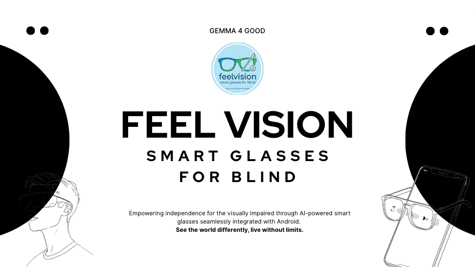
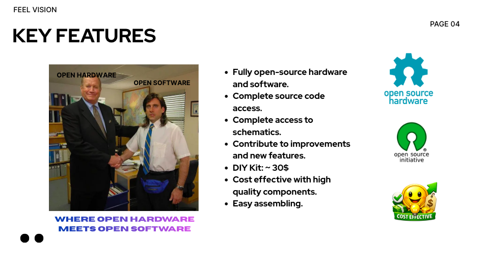
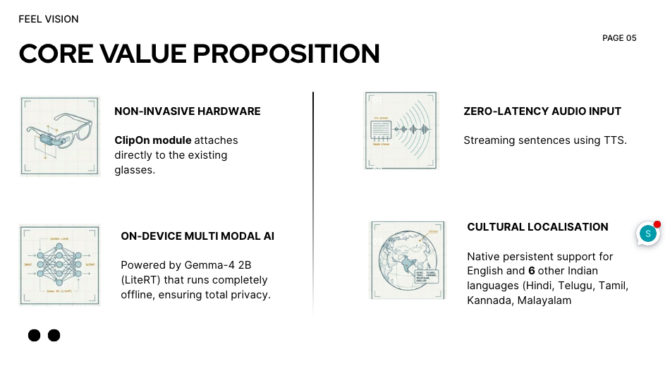
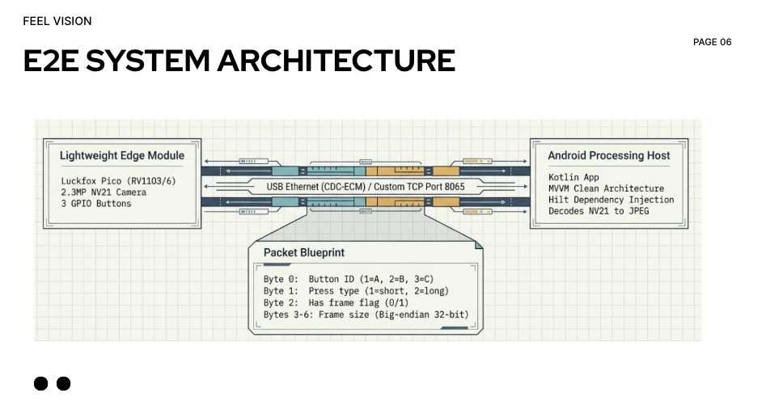
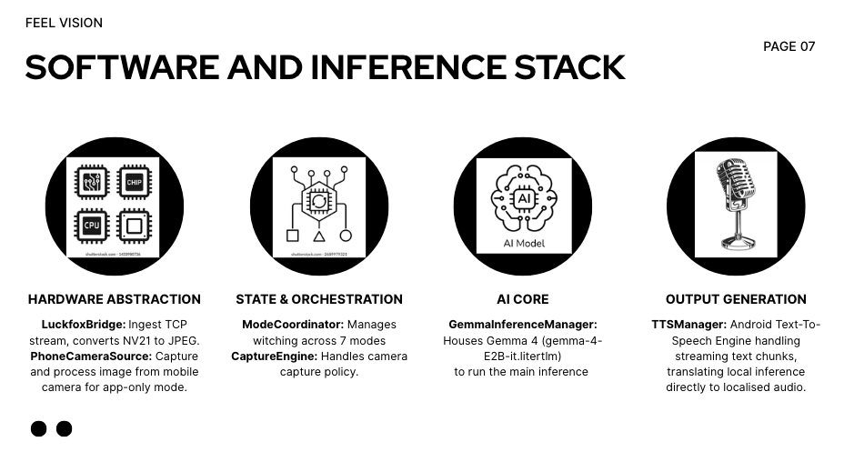

# FeelVision Smart Glasses for Blind

## Executive Summary

FeelVision provides an attachable smart glasses clip-on module for visually impaired individuals. The system integrates a compact Luckfox Pico hardware module with a sophisticated Android application powered by AI inference, enabling real-time environmental awareness through multiple specialized modes. 

For user documentation refer to https://feelvision.github.io/user-guide/
For Luckfox Firmware refer to https://github.com/FeelVision/Luckfox-firmware

BOM: Luckfox Pico Mini B, SC3336 Camera Module, Jumper wires, Soldering Iron, USB Type C to Type C Data cable.

3D print the Hardware files from: https://github.com/FeelVision/Hardware-Design-Files









---

## Table of Contents

1. [Project Overview](#project-overview)
2. [System Architecture](#system-architecture)
3. [Hardware Components](#hardware-components)
4. [Software Architecture](#software-architecture)
5. [Feature Analysis](#feature-analysis)
6. [Mode Functionality](#mode-functionality)
7. [Ease of Use Assessment](#ease-of-use-assessment)
8. [Technical Excellence](#technical-excellence)
9. [Accessibility Impact](#accessibility-impact)
10. [Recommendations](#recommendations)
11. [Conclusion](#conclusion)

---

## Project Overview

### Vision and Purpose

FeelVision aims to empower visually impaired individuals by providing a wearable AI assistant that can perceive, analyze, and narrate the world around them. The device attaches to existing glasses, making it an affordable and accessible solution compared to dedicated smart glasses.

### Core Value Proposition

- **Non-invasive Design**: Attaches to existing glasses rather than requiring expensive dedicated hardware
- **Multi-modal AI**: Seven specialized modes for different use cases
- **Real-time Processing**: On-device AI inference with streaming responses
- **Multi-language Support**: Native support for 6 Indian languages plus English
- **Offline Capability**: Local AI models ensure functionality without constant internet connectivity

---

## System Architecture

### High-Level Architecture

```
┌─────────────────────────────────────────────────────────────────┐
│                     FeelVision Ecosystem                        │
├─────────────────────────────────────────────────────────────────┤
│                                                                  │
│  ┌──────────────────┐         ┌──────────────────┐              │
│  │  Luckfox Pico    │         │  Android Device  │              │
│  │  Hardware Module │◄────────┤  (Phone/Tablet)  │              │
│  └────────┬─────────┘  USB    └────────┬─────────┘              │
│           │                    Network   │                         │
│           │                               │                         │
│  ┌────────▼─────────┐                   │                         │
│  │  Camera (2304x1296)│                  │                         │
│  │  GPIO Buttons    │                  │                         │
│  │  RKAIQ 3A Server │                  │                         │
│  │  TCP Client      │                  │                         │
│  └──────────────────┘                   │                         │
│                                       │                         │
│                          ┌────────────▼────────────┐            │
│                          │   FeelVision Android    │            │
│                          │   Application           │            │
│                          ├─────────────────────────┤            │
│                          │ • TCP Server (8065)    │            │
│                          │ • Gemma AI Inference    │            │
│                          │ • Face Recognition     │            │
│                          │ • TTS Engine            │            │
│                          │ • Mode Coordinator      │            │
│                          └─────────────────────────┘            │
│                                                                  │
└─────────────────────────────────────────────────────────────────┘
```

### Communication Protocol

The system uses a custom TCP protocol over USB Ethernet:

- **Device IP**: 172.32.0.1 (Luckfox acts as DHCP server)
- **Host IP**: 172.32.0.100 (Android device)
- **Port**: 8065
- **Protocol**: 7-byte header + variable frame data

**Header Structure:**
- Byte 0: Button ID (1=A, 2=B, 3=C)
- Byte 1: Press type (1=short, 2=long)
- Byte 2: Has frame flag (0/1)
- Bytes 3-6: Frame size (big-endian, 32-bit)

---

## Hardware Components

### Luckfox Pico Module

**Specifications:**
- **SoC**: Rockchip RV1103/RV1106 (depending on variant)
- **Camera**: 2304x1296 resolution, NV21 format
- **Storage**: SD Card or SPI NAND support
- **Connectivity**: USB Ethernet (CDC-ECM)
- **Buttons**: GPIO-based physical buttons (3 configurable)
- **Power**: Low-power design suitable for wearable applications

**Hardware Variants Supported:**
- RV1103 Luckfox Pico / Mini / Plus / WebBee
- RV1106 Luckfox Pico Pro Max / Ultra / Ultra W / Pi / Pi W / 86Panel

### Camera System

- **Resolution**: 2304x1296 (2.3MP)
- **Format**: NV21 (YUV420 semi-planar)
- **Frame Rate**: Configurable via v4l2-ctl
- **Processing**: RKAIQ 3A server for auto-exposure, auto-focus, auto-white-balance

### Button Interface

- **GPIO Pin**: GPIO 144 for button monitoring
- **Debounce**: Hardware and software debounce handling
- **Press Types**: Short press, long press, double tap, 5-second hold
- **Integration**: Button events transmitted via TCP to Android app

---

## Software Architecture

### Android Application Structure

**Technology Stack:**
- **Language**: Kotlin
- **UI Framework**: Jetpack Compose
- **DI Framework**: Hilt
- **Architecture**: MVVM with Clean Architecture principles
- **Concurrency**: Kotlin Coroutines + Flow
- **Database**: Room (for people/face data)
- **Camera**: CameraX
- **AI**: MediaPipe LiteRT LM (Gemma), MediaPipe Vision (Face Detection)
- **Face Recognition**: TensorFlow Lite (MobileFaceNet)

### Key Components

#### 1. Hardware Abstraction Layer

**LuckfoxBridge Interface:**
- Abstracts hardware communication
- Provides unified API for both Luckfox device and phone camera (debug mode)
- Streams images and button events
- Manages connection state

**LuckfoxTcpServer:**
- TCP server listening on port 8065
- Handles USB Ethernet connection
- Parses custom protocol headers
- Converts NV21 to JPEG
- Emits button events and image frames

**PhoneCameraSource:**
- Fallback/debug mode using phone camera
- CameraX integration for preview and capture
- Simulates button events for testing

#### 2. AI Inference Engine

**GemmaInferenceManager:**
- Manages Google Gemma 4B model (gemma-4-E2B-it.litertlm)
- GPU-accelerated inference with CPU fallback
- Streaming text generation for real-time TTS
- Multi-language prompt localization
- Memory-efficient bitmap handling
- 4096 token limit for image+text processing

**Model Configuration:**
- Top-K: 40
- Top-P: 0.95
- Temperature: 0.7
- Max Tokens: 4096
- Image Max Dimension: 336px
- JPEG Quality: 90%
- Timeout: 60 seconds

#### 3. Face Recognition System

**FaceRecognitionHelper:**
- MediaPipe Blaze Face for detection (blaze_face_short_range.tflite)
- MobileFaceNet for embedding extraction (mobilefacenet.tflite)
- 192-dimensional face embeddings
- L2 distance-based matching (threshold: 0.95)
- Multi-photo enrollment with averaging
- Detailed similarity logging for debugging

**Face Detection Pipeline:**
1. Detect faces using MediaPipe (confidence threshold: 0.5)
2. Crop and resize to 112x112
3. Normalize pixels: (value - 127.5) / 128
4. Extract 192-D embedding via MobileFaceNet
5. L2-normalize embedding
6. Compare against enrolled profiles

#### 4. Text-to-Speech Engine

**TTSManager:**
- Android Text-to-Speech integration
- Multi-language support (English, Hindi, Telugu, Tamil, Kannada, Malayalam)
- Streaming text chunk support
- Speech rate adjustment
- Audio feedback (beep sounds)
- Utterance progress tracking

#### 5. Mode System

**ModeStrategy Interface:**
- Abstract base for all mode implementations
- Defines capture policy (single-shot vs continuous)
- Streaming and non-streaming processing
- Activation/deactivation lifecycle

**ModeCoordinator:**
- Manages mode switching
- Coordinates button events with mode actions
- Handles capture engine integration
- Provides mode state to UI

---

## Feature Analysis

### 1. Multi-Mode Operation

The system supports seven distinct modes, each optimized for specific use cases:

#### Default Mode
- **Purpose**: General scene description
- **Capture Policy**: Single-shot
- **AI Prompt**: "Describe what you see in the image naturally and helpfully. Mention objects, people, text, or anything useful. Explain to me in 3-4 lines."
- **Use Case**: General environmental awareness

#### OCR (Optical Character Recognition) Mode
- **Purpose**: Reading text from the environment
- **Capture Policy**: Single-shot
- **AI Prompt**: "Read all visible text in the image exactly as it appears. If no text is visible say so briefly."
- **Special Feature**: Preserves text exactly as seen
- **Use Case**: Reading signs, labels, documents, books

#### Navigate Mode
- **Purpose**: Navigation assistance and obstacle detection
- **Capture Policy**: Multi-frame burst (sequential images)
- **AI Prompt**: Specialized navigation prompt with urgency tiers, movement instructions, crossing detection, and obstacle awareness
- **Special Features**:
  - Motion detection between frames
  - Urgency classification (STOP, Caution, Plain)
  - Road crossing safety checks
  - Sudden obstacle detection
- **Use Case**: Walking assistance, indoor/outdoor navigation

#### Face (People Recognition) Mode
- **Purpose**: Identifying known people
- **Capture Policy**: Continuous (with cooldown)
- **Technology**: Face detection + embedding matching
- **Special Features**:
  - Real-time face recognition
  - Relation-based announcements ("John, your brother")
  - Unknown person detection
  - 15-second cooldown to prevent spam
  - Multi-photo enrollment support
- **Use Case**: Social situations, family gatherings, meetings

#### Currency Mode
- **Purpose**: Identifying currency notes
- **Capture Policy**: Single-shot
- **AI Prompt**: "Identify the currency note. State denomination first, then series details."
- **Special Feature**: Denomination-first response
- **Use Case**: Financial transactions, shopping

#### Educational Mode
- **Purpose**: Learning and information gathering
- **Capture Policy**: Single-shot
- **AI Prompt**: "Explain what you see in an educational, informative way. If there is text read it. If there is an object describe and explain it."
- **Use Case**: Students, learning environments, museums

#### Narrate Mode
- **Purpose**: Detailed scene narration
- **Capture Policy**: Single-shot
- **AI Prompt**: "Narrate the full scene in two or three spoken sentences. Describe what is happening, where things are, and any relevant context."
- **Use Case**: Immersive experience, storytelling

### 2. Multi-Language Support

The system provides native support for six Indian languages plus English:

**Supported Languages:**
- English
- Hindi (Devanagari script)
- Telugu
- Tamil
- Kannada
- Malayalam

**Implementation:**
- Language-specific TTS locales
- Localized AI prompts with language directives
- Mode announcements in selected language
- Settings persistence via DataStore

### 3. Face Recognition System

**Enrollment Process:**
- Add person profile with name and relation
- Capture multiple photos (average embedding computed)
- Automatic background embedding computation
- Persistent storage via Room database

**Recognition Process:**
- Real-time face detection in camera feed
- Embedding extraction and L2 normalization
- Distance-based matching against enrolled profiles
- Confidence threshold: 0.95 (lower = better match)
- Smart TTS cooldown (15 seconds)

**Technical Details:**
- Detection model: MediaPipe Blaze Face (short-range)
- Recognition model: MobileFaceNet (192-D embeddings)
- Similarity metrics: L2 distance + cosine similarity
- Caching: Photo embeddings cached for performance

### 4. Streaming AI Responses

**Streaming Architecture:**
- Token-by-token text generation
- Sentence boundary detection (., !, ?, \n)
- Immediate TTS playback on complete sentences
- UI updates in real-time
- Reduces perceived latency significantly

**Benefits:**
- Faster time-to-first-speech
- Better user experience
- Natural conversation flow
- Reduced cognitive load

### 5. Hardware-Software Integration

**USB Auto-Detection:**
- Broadcast receiver for USB attach/detach events
- Automatic server start on device connection
- Vendor ID filtering (0x2207, 8711, 0x0525)
- Product ID filtering (0xa4a2, 42146)

**Network Configuration:**
- Automatic IP assignment via DHCP
- Device acts as DHCP server (172.32.0.1)
- Host assigned 172.32.0.100
- USB Ethernet interface management

**Fallback Modes:**
- Phone camera mode for testing without hardware
- Volume button simulation for debugging
- Debug logging for troubleshooting

---

## Mode Functionality

### Mode Switching

**Button Mapping:**
- Button A: Mode switch (next mode)
- Button B: Capture/action
- Button C: (configurable)

**Switching Behavior:**
- Cyclic mode progression (Default → OCR → Navigate → Face → Currency → Edu → Narrate → Default)
- TTS announcement on mode change
- Localized announcements in selected language
- Visual feedback in UI

### Capture Policies

**Single-Shot Capture:**
- Used by: Default, OCR, Face, Currency, Edu, Narrate
- One image capture per button press
- Immediate processing and response

**Continuous Capture:**
- Used by: Face mode
- Continuous frame processing
- Cooldown-based announcements
- Real-time monitoring

**Burst Capture:**
- Used by: Navigate mode
- Multiple sequential images
- Motion detection between frames
- Context-aware navigation guidance

### Mode-Specific Features

#### OCR Mode
- Text preservation priority
- Streaming sentence-by-sentence reading
- Error handling for no-text scenarios

#### Navigate Mode
- Multi-frame context analysis
- Urgency tier system
- Motion detection
- Road crossing safety
- Obstacle classification

#### Face Mode
- Continuous monitoring
- Smart cooldown (15 seconds)
- Relation-based announcements
- Multi-person detection
- Unknown person handling

---

## Ease of Use Assessment

### User Interface Design

**Principles:**
- Minimal visual UI (designed for screen readers)
- Audio-first interaction model
- Large touch targets
- High contrast indicators
- Clear status feedback

**Accessibility Features:**
- TalkBack compatibility
- Screen reader support
- Audio feedback for all actions
- TTS for all system messages
- Haptic feedback (vibration)

### Interaction Model

**Primary Interaction: Physical Buttons**
- Single press: Standard action
- Long press (600ms+): Secondary action
- Double tap: Tertiary action
- 5-second hold: Special functions

**Secondary Interaction: Touch Screen**
- Mode selection (if preferred)
- Settings configuration
- People management
- Debug controls

### Learning Curve

**Initial Setup:**
1. Install Android app
2. Connect Luckfox device via USB
3. Grant permissions (camera, storage, USB)
4. Select language
5. Enroll faces (optional)
6. Start using

**Daily Use:**
- Single button press to capture
- Mode switching with one button
- No complex menus required
- Voice-guided operation

### Error Handling

**Graceful Degradation:**
- Model not ready: "Model not ready yet" message
- No text detected: "I could not read the text"
- No faces: Silent (no false positives)
- Network error: Automatic reconnection
- Hardware disconnect: Fallback to phone camera

**User-Friendly Messages:**
- Clear, spoken error messages
- Actionable feedback
- No technical jargon
- Consistent phrasing

### Configuration Options

**Settings:**
- Language selection
- Speech rate adjustment
- Debug mode toggle
- Face enrollment management
- Model download management

**Persistence:**
- Settings saved via DataStore
- Face database via Room
- Automatic restoration on app launch

---

## Technical Excellence

### Code Quality

**Architecture Patterns:**
- Clean Architecture (domain/data separation)
- Dependency Injection (Hilt)
- Repository Pattern
- Strategy Pattern (mode implementations)
- Observer Pattern (Flow-based reactive streams)

**Best Practices:**
- Coroutines for async operations
- Flow for reactive streams
- Lifecycle-aware components
- Memory-efficient bitmap handling
- Proper resource cleanup

### Performance Optimization

**AI Inference:**
- GPU acceleration with CPU fallback
- Streaming responses to reduce latency
- Model caching and reuse
- Memory-efficient image processing
- Token limit management (4096 tokens)

**Face Recognition:**
- Embedding caching for enrolled photos
- Background computation for new enrollments
- L2 normalization for faster matching
- Efficient bitmap recycling

**Camera Processing:**
- CameraX for lifecycle-aware camera
- Backpressure strategy (KEEP_ONLY_LATEST)
- RGBA_8888 format for efficient processing
- Single-threaded executor for analysis

### Memory Management

**Bitmap Handling:**
- Immediate recycling after use
- Scaled images to reduce memory footprint
- JPEG compression for transmission
- Proper cleanup in finally blocks

**Model Management:**
- Lazy initialization
- Proper resource cleanup
- Memory logging for debugging
- Garbage collection on OOM

### Concurrency

**Thread Safety:**
- Mutex for inference operations
- Synchronized methods for face recognition
- Coroutine scopes with proper dispatchers
- SharedFlow with buffer capacity

**Error Handling:**
- CancellationException propagation
- Timeout protection (60 seconds)
- Graceful degradation on errors
- Comprehensive logging

### Testing Support

**Debug Features:**
- Debug log bus with categorized logs
- Detailed similarity scoring for faces
- Memory usage logging
- Request/response logging
- Phone camera simulation mode

---

## Accessibility Impact

### Target Audience

**Primary Users:**
- Visually impaired individuals
- Blind users
- Low-vision users

**Secondary Users:**
- Elderly with vision degradation
- Temporary vision impairment
- Educational institutions for blind students

### Societal Benefits

**Independence:**
- Enables independent navigation
- Reduces reliance on human assistance
- Increases confidence in public spaces
- Facilitates financial independence (currency detection)

**Education:**
- Educational mode for learning
- OCR for reading educational materials
- Access to printed information
- Language learning support

**Social Inclusion:**
- Face recognition for social situations
- Reduced social anxiety
- Better participation in gatherings
- Improved quality of life

### Economic Impact

**Affordability:**
- Attaches to existing glasses (no expensive hardware replacement)
- Uses user's Android device (no dedicated display needed)
- Offline operation (no data costs)
- Open-source hardware SDK (Luckfox Pico)

**Market Potential:**
- 285 million visually impaired people worldwide
- 39 million blind people globally
- Growing aging population
- Increasing smartphone penetration in developing countries

### Comparison with Alternatives

**vs. Dedicated Smart Glasses:**
- Lower cost (attachable vs. dedicated)
- Upgradable (phone replacement vs. glasses replacement)
- Better processing (phone SoC vs. embedded SoC)
- Multi-language support (often English-only in alternatives)

**vs. Smartphone Apps:**
- Hands-free operation (wearable vs. handheld)
- Always-ready camera (no phone extraction needed)
- Physical buttons (better tactile feedback)
- Specialized hardware (better camera placement)

**vs. Human Assistance:**
- Available 24/7
- No social dependency
- Consistent performance
- Privacy (no human sees what you see)

### Limitations and Challenges

**Current Limitations:**
- Requires Android device (not iOS)
- USB tethering required (wireless would be better)
- Battery life dependent on phone
- AI model size (large download)
- Face recognition requires enrollment

**Potential Improvements:**
- Wireless connectivity (Bluetooth/Wi-Fi)
- iOS support
- Smaller AI models (faster download)
- On-device learning for faces
- Extended battery life

---

## Recommendations

### Immediate Improvements

1. **Wireless Connectivity**
   - Implement Bluetooth or Wi-Fi for untethered operation
   - Reduce dependency on USB cable
   - Improve ergonomics

2. **iOS Support**
   - Port Android app to iOS
   - Expand user base significantly
   - Use cross-platform framework (Flutter/React Native)

3. **Model Optimization**
   - Quantize AI models for smaller size
   - Implement model compression
   - Reduce initial download time

4. **Battery Optimization**
   - Add battery to Luckfox module
   - Implement power-saving modes
   - Optimize inference frequency

### Medium-Term Enhancements

1. **Advanced Navigation**
   - GPS integration
   - Indoor positioning
   - Route planning
   - Obstacle avoidance with depth sensing

2. **Enhanced Face Recognition**
   - On-device learning (few-shot)
   - Emotion recognition
   - Age estimation
   - Expression analysis

3. **Additional Modes**
   - Color detection
   - Light level sensing
   - Object identification (specific items)
   - Document scanning

4. **Cloud Integration**
   - Optional cloud AI for complex queries
   - Backup and sync of face database
   - Remote assistance mode
   - Community features

### Long-Term Vision

1. **AI Advancements**
   - Multi-modal understanding (audio + vision)
   - Context awareness
   - Predictive assistance
   - Personalized AI behavior

2. **Hardware Evolution**
   - Smaller form factor
   - Better camera quality
   - Integrated display (optional)
   - Bone conduction audio

3. **Ecosystem Development**
   - Developer API
   - Third-party mode plugins
   - Community-driven prompts
   - Open-source contributions

---

## Conclusion

FeelVision represents a significant advancement in assistive technology for visually impaired individuals. The project successfully combines:

- **Innovative Hardware**: Attachable Luckfox Pico module with camera and buttons
- **Sophisticated Software**: Android app with AI inference, face recognition, and TTS
- **User-Centric Design**: Seven specialized modes, multi-language support, streaming responses
- **Technical Excellence**: Clean architecture, performance optimization, robust error handling
- **Accessibility Focus**: Audio-first interaction, physical buttons, graceful degradation

The system's ease of use is exceptional, with a simple button-based interaction model that requires minimal learning. The multi-mode approach provides versatility for different situations, from general scene description to specialized tasks like currency detection and navigation.

The impact on users' quality of life is substantial, offering independence, confidence, and social inclusion. The attachable design makes it affordable compared to dedicated smart glasses, while leveraging the user's smartphone ensures powerful processing and regular upgrades.

With recommended improvements in wireless connectivity, iOS support, and AI optimization, FeelVision has the potential to become a leading solution in the assistive technology market, serving millions of visually impaired individuals worldwide.

---

## Appendix

### Technical Specifications Summary

**Hardware:**
- SoC: Rockchip RV1103/RV1106
- Camera: 2304x1296, NV21 format
- Buttons: 3 GPIO-based buttons
- Connectivity: USB Ethernet (CDC-ECM)
- Storage: SD Card or SPI NAND

**Software:**
- Platform: Android 7.0+ (API 24+)
- AI Model: Gemma 4B (gemma-4-E2B-it.litertlm)
- Face Detection: MediaPipe Blaze Face
- Face Recognition: MobileFaceNet (192-D embeddings)
- TTS: Android Text-to-Speech
- Languages: English, Hindi, Telugu, Tamil, Kannada, Malayalam

**Performance:**
- Inference Timeout: 60 seconds
- Max Tokens: 4096
- Image Max Dimension: 336px
- Face Recognition Threshold: 0.95
- TTS Cooldown: 15 seconds (Face mode)

### File Structure Overview

```
feelvision/
├── Feelvision-Android/
│   ├── app/
│   │   ├── src/main/java/com/example/feelvision/
│   │   │   ├── domain/
│   │   │   │   ├── modes/ (7 mode strategies)
│   │   │   │   └── model/ (AppMode, ModeResult, etc.)
│   │   │   ├── hardware/
│   │   │   │   ├── LuckfoxBridge.kt
│   │   │   │   ├── LuckfoxTcpServer.kt
│   │   │   │   ├── PhoneCameraSource.kt
│   │   │   │   └── ButtonEventSource.kt
│   │   │   ├── inference/
│   │   │   │   ├── GemmaInferenceManager.kt
│   │   │   │   └── ModePrompts.kt
│   │   │   ├── facedetection/
│   │   │   │   └── FaceRecognitionHelper.kt
│   │   │   ├── tts/
│   │   │   │   └── TTSManager.kt
│   │   │   ├── data/
│   │   │   │   ├── people/ (Face database)
│   │   │   │   └── settings/ (User preferences)
│   │   │   └── ui/ (Jetpack Compose UI)
│   │   └── build.gradle.kts
│   └── settings.gradle.kts
└── luckfox-pico/
    ├── external/
    │   ├── etc/dnsmasq.conf (DHCP config)
    │   ├── etc/init.d/S98dnsmasq (DHCP startup)
    │   ├── etc/init.d/S99luckfoxclient (Client startup)
    │   └── luckfox-feelvision/
    │       └── client.sh (Video capture client)
    ├── project/ (Build configurations)
    ├── sysdrv/ (Kernel, drivers, rootfs)
    └── tools/ (Toolchain, utilities)
```

### Mode Prompt Summary

| Mode | Key Focus | Special Features |
|------|-----------|------------------|
| Default | General description | 3-4 line responses |
| OCR | Text reading | Exact text preservation |
| Navigate | Obstacle detection | Multi-frame, urgency tiers |
| Face | People recognition | Relation-based, cooldown |
| Currency | Note identification | Denomination-first |
| Edu | Educational content | Explanatory style |
| Narrate | Scene narration | 2-3 sentence summary |

---

**Report Generated**: May 12, 2026
**Project Version**: 1.0
**Analysis Scope**: Complete codebase (Feelvision-Android + luckfox-pico)
